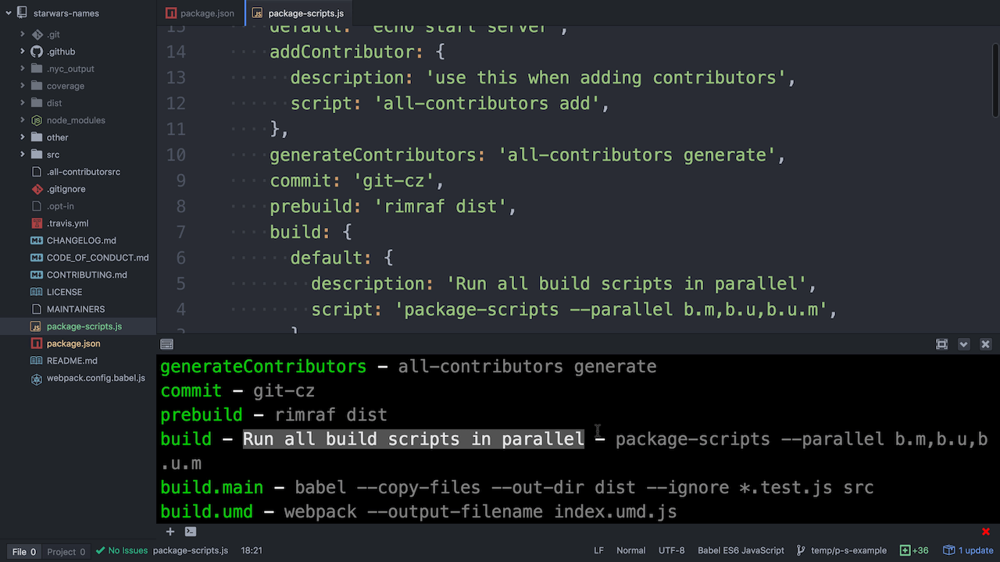

# nps (aka npm-package-scripts)

All the benefits of npm scripts without the cost of a bloated package.json and limits of json

[![Build Status][build-badge]][build]
[![Code Coverage][coverage-badge]][coverage]
[![Dependencies][dependencyci-badge]][dependencyci]
[![version][version-badge]][package]
[![downloads][downloads-badge]][npm-stat]
[![MIT License][license-badge]][LICENSE]

[](#contributors)
[![PRs Welcome][prs-badge]][prs]
[![Donate][donate-badge]][donate]
[![Code of Conduct][coc-badge]][coc]
[![Roadmap][roadmap-badge]][roadmap]
[![Examples][examples-badge]][examples]

## Quick Video Intro :tv:

<a href="http://kcd.im/p-s-video" title="Simplify and empower npm scripts with nps">
  
</a>

[Simplify and empower npm scripts with `nps`][video] 11:19

## The problem

Even though npm scripts have a ton of advantages ([learn more][scripts-advantages]), it can grow into an
[unmaintainable mess][mess] in your `package.json` file. Part of the problem is we're configuring scripts in `json`
which has fundamental issues (like no comments).

## This solution

Put all of your scripts in a file called `npsfile.js` and use `nps` in a single `package.json` script:

**package.json**

```json
{
  "scripts": {
    "start": "npm-package-scripts"
  }
}
```

**npsfile.js**

```javascript
module.exports = {
  scripts: {
    default: 'node index.js',
    lint: 'eslint .',
    test: {
      default: 'ava',
      watch: {
        script: 'ava -w',
        description: 'run in the amazingly intelligent AVA watch mode'
      }
    },
    build: {
      default: 'webpack',
      prod: 'webpack -p',
    },
    validate: 'nps --parallel lint,test,build',
  },
}
```

Then you can run:

```console
npm start # runs `node index.js`
npm start lint # runs `eslint .`
npm start test.watch # runs `ava -w`
npm start validate # runs the lint, test, and build scripts in parallel
```

But the fun doesn't end there! You can use a prefix:

```console
npm start b # will run the build script
```

And these prefixes can go as deep as you like!

```console
npm start b.p # will run the production build script
```

And if you want to speed things up even more, you can install [`npm-quick-run`][quick-run] and then:

```console
nr s build.prod
```

Cool stuff right? And there's more on [the roadmap][roadmap].

**Also** check out the [examples][examples]. You'll find some good stuff in there (including how to deal with windows
and other cross-platform issues).

**Note:** You don't have to use the `start` script if you don't want. If you're writing a node application, you're
likely using this for starting your server. In that case, you can create a `default` script which will be run when
`nps` is run without arguments (so effectively it'll work just the same). But if you'd prefer, you can use whatever you
wish. For example you could easily create a `nps` script and do: `npm run nps b`.

## Installation

This module is distributed via [npm][npm] which is bundled with [node][node] and should
be installed as one of your project's `devDependencies`:

```
npm install --save-dev nps
```

### global installation

You can install this module globally also:

```
npm install --global nps
```

From here you can use `nps` on the command line via one of the installed aliases: `nps`, `npm-package-scripts`, or `nps`.
If you do this, you may also be interested in installing the shell autocompletion script. Do so by running:

```
nps completion <optionally-your-bash-profile-file>
```

The bash profile file defaults to `~/.bash_profile` for bash and `~/.zshrc` for zsh. Special thanks to the
[`omelette`][omelette] package for making this so easy.

## Getting started

If you're already using npm scripts, you can get up and going really quickly with the `init` command:

```
./node_modules/.bin/nps init
```

This will use your `package.json` `scripts` to generate a `npsfile.js` file and update your `scripts` to
utilize the `npm-package-scripts` binary.

## API

### CLI

The CLI is fairly simple. It allows for a few options. The `nps` binary is available in your `node_modules/.bin`
directory when you install it locally in a project so you can use it in your `npm` scripts. We also expose a
`npm-package-scripts` alias binary so you can use that as well if you'd like the script to be [more clear][clarity].

```console
$ nps --help

  Usage: nps [options]

  Options:

    -h, --help                                  output usage information
    -V, --version                               output the version number
    -s, --silent                                Silent nps output
    -p, --parallel <script-name1,script-name2>  Scripts to run in parallel (comma seprated)
    -c, --config <filepath>                     Config file to use (defaults to nearest npsfile.js)
    -l, --log-level <level>                     The log level to use (error, warn, info [default])
    -r, --require <module>                      Module to preload

Available scripts (camel or kebab case accepted)

lint - Lint all files with eslint. Configuration is in package.json - eslint .
test - Run tests with AVA. See package.json for config - ava
test.watch - Run in the amazingly intelligent AVA watch mode - ava -w
build - The normal webpack UMD build for development - webpack
build.prod - The production webpack build - webpack -p
```

#### Commands

##### help

If you have a `help` script, then your `help` script will be run. Otherwise, this will output the help.

> Note: you can do this with `nps --help`, but if you're using the `start` script in your `package.json` this allows you
> to run `npm start help` rather than `npm start -- --help`

##### init

As indicated above, this will migrate your npm scripts to npm-package-scripts.

##### completion

Installs autocompletion functionality into your default bash or zsh configuration. You can override the default by
providing a specific file:

```console
nps completion ~/.bashrc
```

Note: you should probably only do this if you have the package installed globally. In that case you should probably also
normally use the `nps` alias rather than `nps` because it's easier to type.

#### CLI options

##### -h, --help

Will print out the help you see above (the available scripts are colored 🌈 and come from the config specified/default
config).

##### -s, --silent

By default, `nps` will log out to the console before running the command. You can add `-s` to your command to silence
this.

##### -p, --parallel

Run the given scripts in parallel. This enables handy workflows like this:

```console
npm start -p lint,build,cover && npm start check-coverage && npm start report-coverage
```

##### -c, --config

Use a different config

```
npm start -c ./other/npsfile.js lint
```

Normally, `nps` will look for a `npsfile.js` file and load that to get the scripts. Generally you'll want to
have this at the root of your project (next to the `package.json`). But by specifying `-c` or `--config`, `nps` will
use that file instead.


##### -l, --log-level

Specify the log level to use

##### -r, --require

You can specify a module which will be loaded before the config file is loaded. This allows you to preload for example babel-register so you can use all babel presets you like.

##### args

You can pass additional arguments to the script(s) that are being spawned:

```console
npm start lint --fix # --fix will be passed on to the lint script
```

##### scripts

If you don't use `-p` (because you don't need parallelism) then you can simply provide the name of the script like so:

```console
npm start cover
```

And you can run multiple scripts in series by providing a comma-separated list:

```console
npm start cover,check-coverage
```

That's all for the CLI.

### npsfile.js

`nps` expects to your `npsfile.js` file to `module.exports` an object with the following properties:

#### scripts

This can be an object or a function that returns an object. See the annotated example below for what this object can
look like (and different ways to run them):

```javascript
module.exports = {
  scripts: {
    default: 'echo "This runs on `npm start`"', // npm start
    // you can assign a script property to a string
    simple: 'echo "this is easy"', // npm start simple
    test: {
      default: {
        script: 'ava', // npm start test
        description: 'Run tests with ava',
        // your scripts will be run with node_modules/.bin in the PATH, so you can use locally installed packages.
        // this is done in a cross-platform way, so your scripts will work on Mac and Windows :)
        // NOTE: if you need to set environment variables, I recommend you check out the cross-env package, which works
        // great with nps
      },
      otherStuff: {
        // this one can be executed two different ways:
        // 1. npm start test.otherStuff
        // 2. npm start test.other-stuff
        script: 'echo "testing other things"',
        description: 'this is a handy description',
      },
    },
    // this one can be executed a few different ways:
    // 1. npm start k
    // 2. npm start kebab-case
    // 3. npm start kebabCase
    'kebab-case': 'echo "kebab-case"',
    series: 'nps simple,test,kebabCase', // runs these other scripts in series
  },
}
```

Remember, I find it considerably nicer to just use [`npm-quick-run`][quick-run] and then I can do:

```console
nr s k # runs npm start kebab-case
```

#### options

This object is used to configure `nps` with the following options:

##### silent

Setting this to `true` will prevent `nps` from outputting anything for your script (normally you'll get simple output
indicating the command that's being executed). This effectively sets the `logLevel` to `disable`.

##### logLevel

This sets the logLevel of `nps`.

## ENV variables

### LOG_LEVEL

By setting `LOG_LEVEL` environment variable you can control the log level for `nps`

## Log level

Log levels available:

- `error` - errors only
- `warn` - errors and warnings only
- `info` - info, errors, and warnings (default)

## FAQ

### Why `npm start`?

_Just to be clear:_ You do **not** have to use the `start` script. You can use whatever you like. But I recommend using
the `start`. [npm scripts][npm scripts] are generally run with `npm run <script-name>`. There are some exceptions to
this. For example:

1. `npm run test` === `npm test` === `npm t`
2. `npm run start` === `npm start`

So, while you could use a script called `script` and run `npm run script build`, I just think it reads more clearly to
just use the `start` script and run `npm start build`. It's also nice that it's fewer things to type. You could also use
the `test` script and then type even less: `npm t build`, but thats just... odd.

Note, often servers are configured to run `npm start` by default to start the server.
To allow for this case, you can provide a `default` script at the root of your scripts
which will be run when `nps` is run without any arguments. Effectively this will
allow you to have a script run when `npm start` is executed.

## Inspiration

This was inspired by [a tweet][tweet] by [@sindresorhus][sindre].

## Other Solutions

- [scripty][scripty] has a solution for this problem as well. The reason I didn't go with that though is you still need
a line for every script (one of the pains I'm trying to solve) and a each script requires its own file (one of the
benefits of npm scripts I wanted to keep).

## In the wild

- [react-component-template](https://github.com/nkbt/react-component-template) uses `nps` to implement shareable npm scripts. See then how dependent [react-swap](https://github.com/nkbt/react-swap) can reuse them.

  GOTCHAS:
    - use `process.cwd()` as the base for all paths

- [Hypercubed/EventsSpeedTests](https://github.com/Hypercubed/EventsSpeedTests) uses `nps` to automate benchmark running and reporting in node and the browser.  `npsfile.js` enables us to keep our scripts DRY.  Combined with [grunion](https://github.com/Hypercubed/grunion) allows benchmarks to be run, serially or concurrently, on glob patterns.

- [SmithersAssistant/Smithers](https://github.com/SmithersAssistant/smithers) is an [electron](https://electron.atom.io) based personal assistant. Smithers works on multiple platforms. Smithers uses `nps` to dynamically find the current platform and execute the dev environment. Now we don't have to manually update the `package.json` scripts when you are on a different platform!

## Contributors

Thanks goes to these people ([emoji key][emojis]):

<!-- ALL-CONTRIBUTORS-LIST:START - Do not remove or modify this section -->
| [<br /><sub>Kent C. Dodds</sub>](http://kent.doddsfamily.us)<br />[💻](https://github.com/kentcdodds/nps/commits?author=kentcdodds) [📖](https://github.com/kentcdodds/nps/commits?author=kentcdodds) 🚇 💡 📹 👀 | [<br /><sub>David Wells</sub>](http://davidwells.io)<br />[💻](https://github.com/kentcdodds/nps/commits?author=DavidWells) | [<br /><sub>Abhishek Shende</sub>](https://twitter.com/abhishekisnot)<br />[💻](https://github.com/kentcdodds/nps/commits?author=abhishekisnot) [⚠️](https://github.com/kentcdodds/nps/commits?author=abhishekisnot) | [<br /><sub>Rowan Oulton</sub>](http://travelog.io)<br />[💻](https://github.com/kentcdodds/nps/commits?author=rowanoulton) [📖](https://github.com/kentcdodds/nps/commits?author=rowanoulton) [⚠️](https://github.com/kentcdodds/nps/commits?author=rowanoulton) | [<br /><sub>Gilad Goldberg</sub>](https://github.com/giladgo)<br />[💻](https://github.com/kentcdodds/nps/commits?author=giladgo) | [<br /><sub>Tim McGee</sub>](https://github.com/tim-mcgee)<br />[💻](https://github.com/kentcdodds/nps/commits?author=tim-mcgee) [📖](https://github.com/kentcdodds/nps/commits?author=tim-mcgee) | [<br /><sub>Nik Butenko</sub>](http://butenko.me)<br />💡 [💻](https://github.com/kentcdodds/nps/commits?author=nkbt) |
| :---: | :---: | :---: | :---: | :---: | :---: | :---: |
| [<br /><sub>Tommy</sub>](http://www.tommyleunen.com)<br />[🐛](https://github.com/kentcdodds/nps/issues?q=author%3Atleunen) [💻](https://github.com/kentcdodds/nps/commits?author=tleunen) [⚠️](https://github.com/kentcdodds/nps/commits?author=tleunen) 👀 | [<br /><sub>Jayson Harshbarger</sub>](http://www.hypercubed.com)<br />💡 👀 | [<br /><sub>JD Isaacks</sub>](http://www.jisaacks.com)<br />[💻](https://github.com/kentcdodds/nps/commits?author=jisaacks) [⚠️](https://github.com/kentcdodds/nps/commits?author=jisaacks) | [<br /><sub>Christopher Hiller</sub>](https://boneskull.com)<br />👀 | [<br /><sub>Robin Malfait</sub>](robinmalfait.com)<br />💡 | [<br /><sub>Eric McCormick</sub>](https://ericmccormick.io)<br />👀 | [<br /><sub>Sam Verschueren</sub>](https://twitter.com/SamVerschueren)<br />👀 |
<!-- ALL-CONTRIBUTORS-LIST:END -->

This project follows the [all-contributors][all-contributors] specification.
Contributions of any kind welcome!

## LICENSE

MIT

[scripts-advantages]: https://medium.freecodecamp.com/why-i-left-gulp-and-grunt-for-npm-scripts-3d6853dd22b8#.9qghcfdr9
[mess]: https://github.com/ReactiveX/rxjs/blob/a3ec89605a24a6f54e577d21773dad11f22fdb14/package.json#L14-L96
[roadmap]: https://github.com/kentcdodds/nps/blob/master/other/ROADMAP.md
[examples]: https://github.com/kentcdodds/nps/blob/master/other/EXAMPLES.md
[quick-run]: https://npmjs.com/package/npm-quick-run
[npm]: https://www.npmjs.com/
[node]: https://nodejs.org
[build-badge]: https://img.shields.io/travis/kentcdodds/nps/master.svg?style=flat-square
[build]: https://travis-ci.org/kentcdodds/nps
[coverage-badge]: https://img.shields.io/codecov/c/github/kentcdodds/nps.svg?style=flat-square
[coverage]: https://codecov.io/github/kentcdodds/nps
[dependencyci-badge]: https://dependencyci.com/github/kentcdodds/nps/badge?style=flat-square
[dependencyci]: https://dependencyci.com/github/kentcdodds/nps
[version-badge]: https://img.shields.io/npm/v/nps.svg?style=flat-square
[package]: https://www.npmjs.com/package/nps
[downloads-badge]: https://img.shields.io/npm/dm/nps.svg?style=flat-square
[npm-stat]: http://npm-stat.com/charts.html?package=nps&from=2016-04-01
[license-badge]: https://img.shields.io/npm/l/nps.svg?style=flat-square
[license]: https://github.com/kentcdodds/nps/blob/master/LICENSE
[prs-badge]: https://img.shields.io/badge/PRs-welcome-brightgreen.svg?style=flat-square
[prs]: http://makeapullrequest.com
[donate-badge]: https://img.shields.io/badge/%EF%BC%84-support-green.svg?style=flat-square
[donate]: http://kcd.im/donate
[coc-badge]: https://img.shields.io/badge/code%20of-conduct-ff69b4.svg?style=flat-square
[coc]: https://github.com/kentcdodds/nps/blob/master/other/CODE_OF_CONDUCT.md
[roadmap-badge]: https://img.shields.io/badge/%F0%9F%93%94-roadmap-CD9523.svg?style=flat-square
[examples-badge]: https://img.shields.io/badge/%F0%9F%92%A1-examples-8C8E93.svg?style=flat-square
[tweet]: https://twitter.com/sindresorhus/status/724259780676575232
[sindre]: https://github.com/sindresorhus
[emojis]: https://github.com/kentcdodds/all-contributors#emoji-key
[all-contributors]: https://github.com/kentcdodds/all-contributors
[clarity]: https://github.com/kentcdodds/nps/issues/1
[scripty]: https://npmjs.com/package/scripty
[npm scripts]: https://docs.npmjs.com/misc/scripts
[video]: http://kcd.im/nps-video
[omelette]: https://npmjs.com/package/omelette
